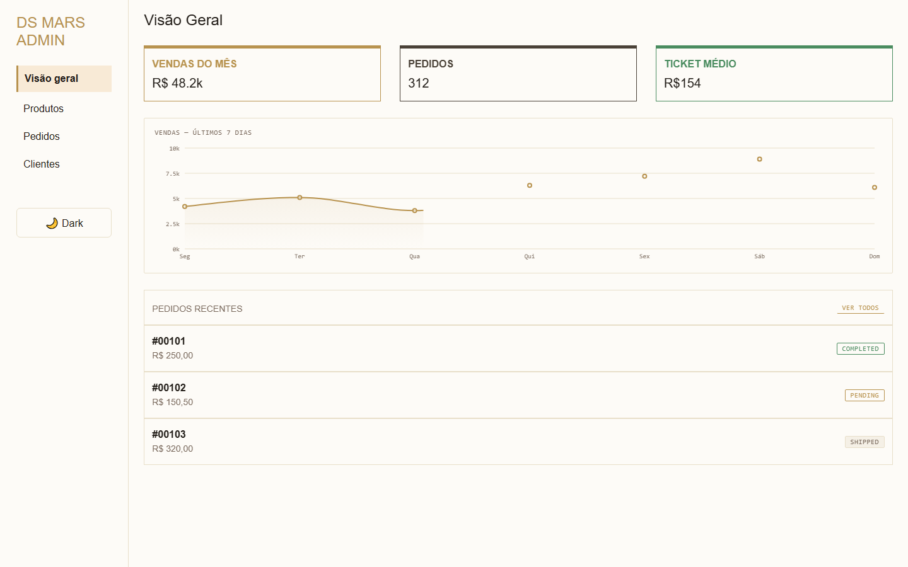
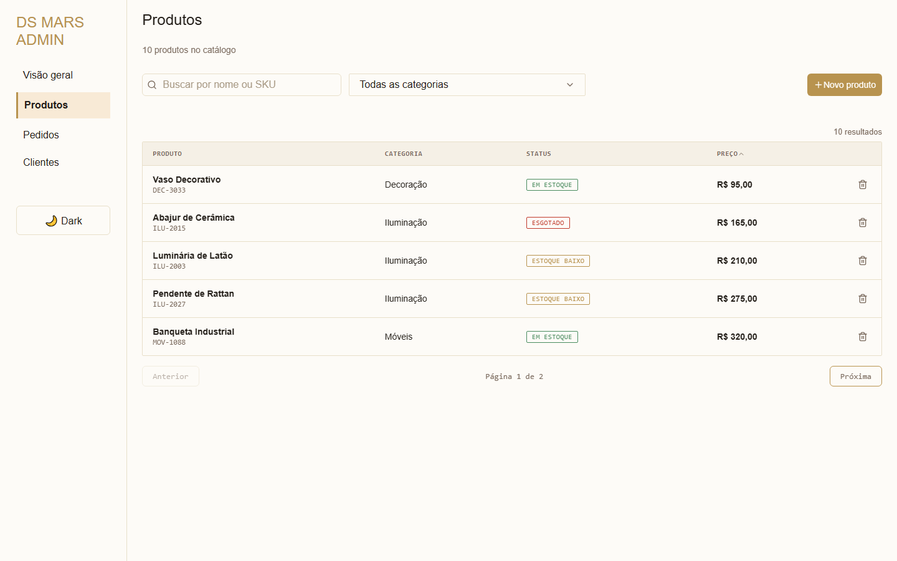
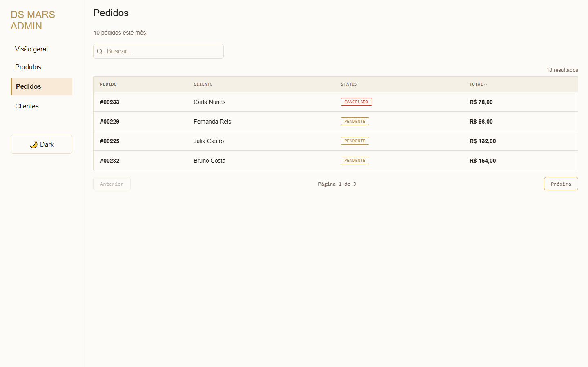
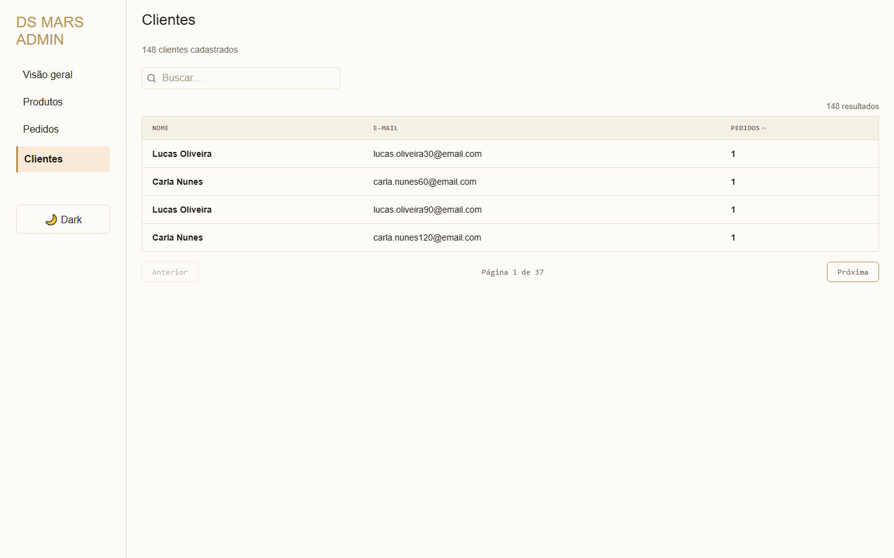

# Dashboard MARS

Painel administrativo construído com Next.js para gestão de produtos, pedidos e clientes, consumindo o [design-system-mars](../design-system-mars) — um design system próprio com suporte a tema claro/escuro.

## Screenshots

| Visão geral | Produtos |
|---|---|
|  |  |

| Pedidos | Clientes |
|---|---|
|  |  |

## Funcionalidades

- **Visão geral** — cards de resumo, gráfico de vendas dos últimos 7 dias (Recharts) e lista de pedidos recentes.
- **Produtos** — busca por nome/SKU, filtro por categoria, ordenação por preço, paginação, cadastro de novos produtos com validação de formulário e exclusão com confirmação em modal.
- **Pedidos** — busca por número do pedido/cliente, ordenação por total e paginação.
- **Clientes** — busca por nome/e-mail, ordenação por quantidade de pedidos e paginação.
- **Tema claro/escuro** com `ThemeToggle` do design system.
- **Layout responsivo**, com menu de navegação em drawer no mobile e navegação inline no desktop.

## Stack

- [Next.js 16](https://nextjs.org) (App Router)
- [React 19](https://react.dev) + TypeScript
- [Sass Modules](https://sass-lang.com) para estilos por componente
- [Recharts](https://recharts.org) para o gráfico de vendas
- [Lucide React](https://lucide.dev) para ícones
- `design-system-mars` — componentes de UI (Button, Input, Select, Modal, Badge, Checkbox, ThemeToggle) consumidos como workspace local

## Estrutura do projeto

```
src/
├── app/               # Rotas (App Router): /, /products, /orders, /clients
├── components/        # Componentes de página e UI (Header, Main, TableSection, etc.)
├── constants/         # Dados mockados e opções de filtro/formulário
├── styles/            # Mixins Sass compartilhados
└── interface.ts       # Tipos compartilhados (Product, Order, Client, ...)
```

Os dados de produtos, pedidos e clientes são mockados em `src/constants/` e mantidos em memória via `useState` — não há persistência entre recarregamentos de página.

## Como rodar

Este projeto depende do [design-system-mars](https://github.com/joaovxsantos/design-system-mars) como dependência via Git (`github:joaovxsantos/design-system-mars#main`), instalado normalmente pelo `npm install` — não é mais necessário ter o repositório clonado localmente ao lado deste.

```bash
npm install
npm run dev
```

Abra [http://localhost:3000](http://localhost:3000) para ver o resultado.

### Outros scripts

```bash
npm run build   # build de produção
npm run start   # inicia o build de produção
npm run lint    # lint com ESLint
```
